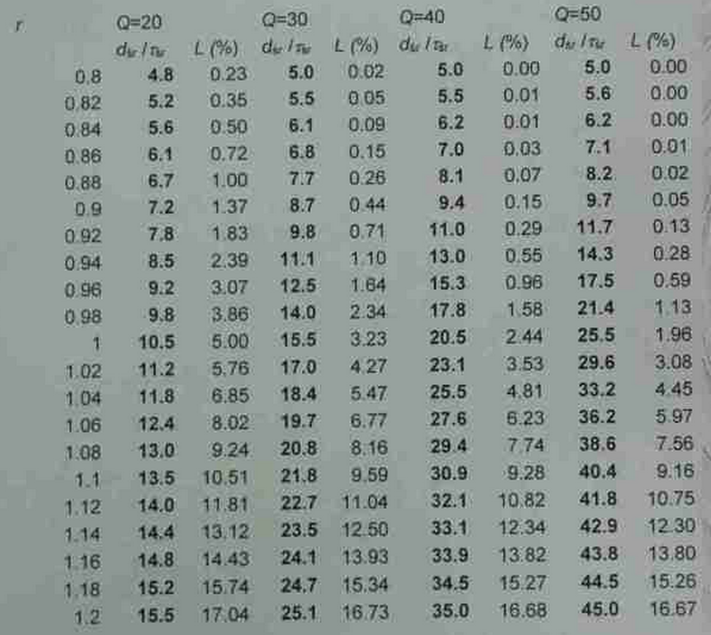

#Kolokwium 2014 - Zadanie 1

#### cechy zadania: zadanie z tabelą - średnich znormalizowanych opóźnienień systemowych

1-procesorowy system kolejkowy o skończonej pojemności ma przyjmować raporty z 20 końcówek telemetrycznych.
Każda końcówka generuje średnio 30 raportów na minutę o średnim rozmiarze raportu 1040 rekordów. Dopuszcza się średnie opóźnienie systemowe raportu do 2.7s oraz do 5% raportów utraconych w skutek przepełnienia.
Dostępne są procesory o wydajności v = 9600, 10000 i 10400 rekordów/s oraz pojemności pamięci buforowej Q = 20, 30, 40 i 50 raportów.

Dobierz najmniejsze możliwe Q i v przy powyższych ograniczeniach. Jaki będzie współczynnik obciążenia procesora ?

W tabeli pokazano średnie opóźnienia systemowe znormalizowane względem średniego czasu przetwarzania raportu oraz frakcje strat dla różnych Q i współczynników obciążenia procesora r.

 
