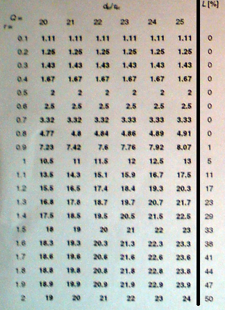

#Kolokwium 20XX - Zadanie 1

#### cechy zadania: zadanie obecnie - bez rozwiązania

Dla 1-procesorowego systemu masowej obsługi z pamięcią buforową o pojemności Q oraz współczynnikiem obciążenia r tabela podaje normalizowane średnie opóźnienie systemowe oraz (praktycznie stałą w podanym zakresie Q) Frakcję strat wskutek przepełnienia. 
Mamy 10 użytkowników, z których każdy w ciągu sekundy generuje średnio 4 pliki tekstowe po 100KB. Procesor przetwarza pliki z prędkością 4000 KB/s.

a) jakie będzie średnie opóźnienie systemowe ( w milisekundach ) i frakcja strat przy Q = 21 ?

b) do jakich wartości wzrosną one po zwiększeniu liczby użytkowników do 12?

c) Ile wyniosą, gdy następnie prędkość przetwarzania w procesorze zwiększy się o połowę ?

