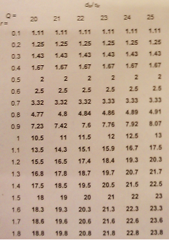

#Kolokwium 20YY - Zadanie 1

Dla 1-procesorowego systemu masowej obsługi tabela podaje znaormalizowane średnie opóźnienie systemowe w zależności od pojemności pamięci buforowej Q oraz współczynnika obciązenia r.
Mamy 8 użytkowników, z których każdy w ciągu sekundy generuje średnio 3 pliki tekstowe po 200KB. Procesor przetwarza pliki z prędkością 4.8 MB/s.

a) jakie będzie średnie opóźnienie systemowe ( w milisekundach ) przy pamięci buforowej o pojemności 22?

b) Do jakiej wartości wzrośnie ono po zwiększeniu liczby użutkowników do 12 ?

c) Ile wyniesie, gdy następnie prędkość przetwarzania w procesorze zwiększymy o połowę.

#### Dane

> $$ J = 8 $$ - użytkowników

> $$ a_{sr} = \frac{1}{J} = \frac{1}{8} s $$ 

> $$ b_{sr} = 3 pliki * 200 KB = 600KB $$

> $$ v = 4,8 MB/s = 4800 KB/s $$

> $$ Q = 22 $$

#### Rozwiązanie

###### A)

$$ r = \frac{b_{sr}}{a_{sr} * v} = \frac{600 KB}{0,125s * 4800 KB/s} = 1 $$

z treści zadania: Q = 22, więc przy r = 1 stosunek $$ \frac{d_{sr}}{\tau_{sr}} = 11.5 $$

$$ d_{sr} = \tau_{sr} * 11.5 = \frac{b_{sr}}{v} * 11.5 = \frac{600}{4800} * 11.5 = 1.4375 s $$ = **1437.5 milisekund**

###### B)

$$ J = 12 $$ 

$$ a^{(B)}_{sr} = \frac{1}{J} = \frac{1}{12} s $$

$$ r^{(B)} = \frac{b_{sr}}{a^{(B)}_{sr} * v} = \frac{600 KB}{\frac{1}{12} * 4800 KB/s} = 1.5 $$

z treści zadania: Q = 22, więc przy r = 1.5 stosunek $$ \frac{d_{sr}}{\tau_{sr}} = 20 $$

$$ d_{sr} = \tau_{sr} * 20 = \frac{b_{sr}}{v} * 20 = \frac{600}{4800} * 20 = 2.5 s = $$ **2500 milisekund** 

###### C)

$$ v^{(C)} = 150\% * v = 7200KB/s $$

$$ r^{(C)} = \frac{b_{sr}}{a^{(B)}_{sr} * v^{(C)}} = \frac{600 KB}{\frac{1}{12} * 7200 KB/s} = 1 $$

z treści zadania: Q = 22, więc przy r = 1 stosunek $$ \frac{d_{sr}}{\tau_{sr}} = 11.5 $$

$$ d_{sr} = \tau_{sr} * 11.5 = \frac{b_{sr}}{v} * 11.5 = \frac{600}{7200} * 11.5 = 0.9583 s = $$ **9583 milisekund** 

