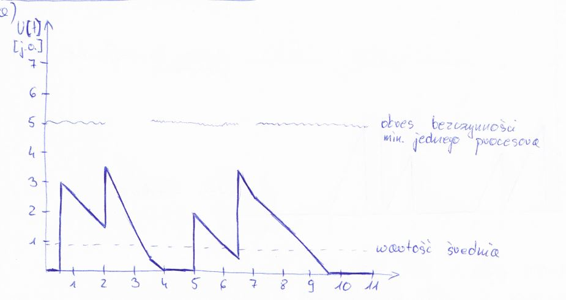
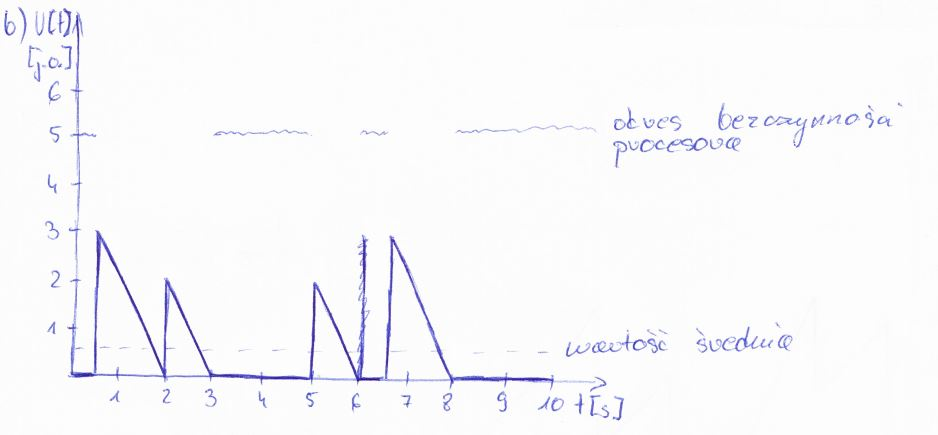

#ZADANIE 1-01

## Treść

Narysuj przebieg procesów kolejkowych $$ N(t) $$ oraz $$ U(t) = {praca do zakonczenia} $$ w systemie masowej obsługi przyjmującego strumień zgłoszeń:
$$(t^{+}_{n}) $$ = (0.5, 2, 5, 6.5)
$$(b_n) =(3, 2, 2, 3) $$

dla dwóch przypadków: 

a) S = 2 procesory o wydajności v = 1 j.o./s każdy (pełna dostępność, obsługa umiejscowiona), 

b) S = 1 procesor o wydajności v = 2 j.o./s. Porównaj te przypadki.

Pytania:
 
Co jest podstawą porównania obu przypadków? 

Czy S = 2 pod jakimś względem góruje nad S = 1?

## Rozwiązanie

### A)

1. w t = 0.5 pojawia się zgłoszenie $$ b_1 = 3 $$
2. do t = 2 wykonywane jest zgłoszenie $$ b_1 $$ (pozozstaje 1,5)
3. w t = 2 pojawia się zgłoszenie $$ b_2 = 2 $$
4. do t = 3,5 równolegle wykonywane są oba zgłoszenia, gdzie $$ b_1 $$ (się kończy) a $$ b_2 $$ ( wynosi jeszcze 0.5 )
5. do t = 4 kończy się wykonywanie $$ b_2 $$ 
6. do t = 5 procesory pozostają bezczynne
7. w t = 5 pojawia się zgłoszenie $$ b_3 = 2 $$
8. do t = 6,5 wykonywane jest zgłoszenie $$ b_3 $$ ( pozostaje 0.5 )
9. w t = 6,5 pojawia się zgłoszenie $$ b_4 = 3 $$
10. do t = 7 wykonywane są równolegle zgłoszenia $$ b_3 $$ i $$ b_4 $$
11. do t = 9,5 wykonywane jest zgłoszenie $$ b_4 $$

### B)

1. w t = 0.5 pojawia się zgłoszenie $$ b_1 = 3 $$
2. zgłoszenie $$ b_1 $$ wykonywane jest do t = 2
3. w t = 2 pojawia się zgłoszenie $$ b_2 = 2 $$
4. zgłoszenie $$ b_2 $$ wykonywane jest do t = 3
5. w t = 5 pojawia się zgłoszenie $$ b_3 = 2 $$
6. zgłoszenie $$ b_3 $$ wykonywane jest do t = 6
7. w t = 6,5 pojawia się zgłoszenie $$ b_4 = 3 $$
8. zgłoszenie $$ b_4 $$ wykonywane jest do t = 8

----------
**Odpowiedź:**
 
Co jest podstawą porównania obu przypadków? 
podstawą porównania obu przypadków jest wartość średnia. 

Czy S = 2 pod jakimś względem góruje nad S = 1? 
Lepiej wykorzystuje procesor ( krótszy czas bezczynności )
 

