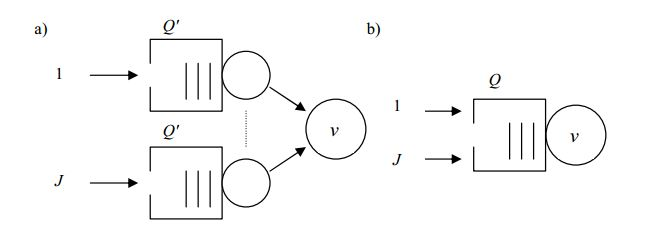

#ZADANIE 3-03

#### cechy zadania: zadanie obecnie - bez rozwiązania

Każdy sposród użytkowników systemu jednoprocesorowego generuje strumień dokumentów ze 
średnim interwałem $$ a_{sr} $$ 
Długości dokumentów mają średnią $$ b_{sr} $$.
Wydajność przetwarzania dokumentów przez procesor wynosi $$ v $$.

Dopuszcza się:       

* frakcję dokumentów utraconych wskutek przepełniani a nie wiekszą niż $$ L_{max} $$ 
* Średnie opóźnienie systemowe dokumentu nie większe niż c-krotność $$ \frac{b_{sr}}{v} $$ 

Porównaj maksymalną liczbę $$ J_{max} $$ użytkowników oraz wymaganą pojemność pamięci buforowych dla przypadków:

A. Dostęp dedykowany z procesorami wurtualnymi o jednakowej wydajnośći i z odrębnymi kolejkami.

B. Dostęp ze wspólną kolejką do procesora fizycznego.

Przykładowe dane dla porównania przypadków A i B $$ a_{sr} = 6s $$ , $$ b_{sr} = 0.6 KB $$, $$ v = 24 KB $$, $$ L_{max} = 0.1\% $$, $$ c = 5 $$

### Dane:

> System typu: M/M/1/Q
        
> $$ a_{sr} = 6s $$

> $$ b_{sr} = 0.6 KB $$

> $$ v = 24 KB $$

> $$ L_{max} = 0.1\% $$

> $$ c = 5 $$

## Rozwiązanie

----
## Odpowiedź

 

