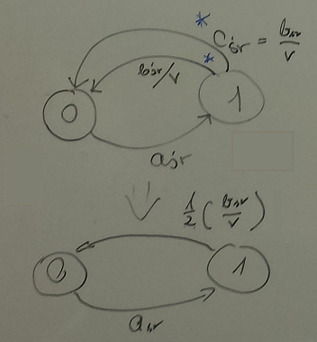

#ZADANIE 5-04

Zgłoszenia przybywają do systemu M/M/1 średnio co $$a_{sr} = 10 s$$, średnie wymaganie wynosi $$b_sr = 10 j.o.$$,
zaś wydajność procesora $$v = 1 \frac{j.o}{s}$$.
W chwili przybycia każde zgłoszenie losuje swój "próg cierpliwości" z rozkładu wykładniczego o średniej $$c_{sr}$$ 
Jeżeli po jego upływie ciągle jeszcze oczekuje na rozpoczęcie obsługi – ucieka z kolejki. 
Przyjmując $$c_{sr} = \frac{b_{sr}}{v}$$ znajdź rozkład liczby zgłoszeń w systemie i frakcję zgłoszeń, które uciekły z kolejki.

#### Dane

> $$a_{sr} = 10s$$

> $$b_{sr} = 10 j.o.$$

> $$v = 1 \frac{j.o.}{s}$$

> $$c_{sr} = \frac{b_{sr}}{v}$$ - próg cierpliwości

> $$Q = \infty$$

#### Rozwiązanie

równanie urodzin i śmierci : $$\frac{p_k}{a_{sr}} = \frac{p_{k+1}}{\frac{b_{sr}}{v}}$$

$$\frac{p_k}{a_{sr}} = \frac{p_{k+1}}{\frac{1}{2} * \frac{b_{sr}}{v}}$$

$$p_k * \frac{b_{sr}}{2 * v} = p_{k+1} * a_{sr}$$

$$p_{k+1} = \frac{p_k * \frac{b_{sr}}{2 * v}}{a_{sr}}$$

$$p_{k+1} = \frac{p_k * \frac{10 j.o.}{2 * 1 \frac{j.o}{s}}}{10 s} = \frac{1}{2} * p_k$$

$$p_{k+1} = \frac{1}{2} * p_k$$

$$ p_0 + p_1 + p_2 + ... + p_Q = 1 = \frac{p_0}{1 - 1/2}$$ - suma nieskończonego ciągu geometrycznego
  
$$p_0 = \frac{1}{2}$$

> $$1 - p_0 = (1-L)* r \Rightarrow L = 1 - \frac{1-p_0}{r}$$ - równanie ciągłości przepływu
 
$$r = \frac{b_{sr}}{a_{sr} * v} = \frac{10}{10 * 1} = 1$$

$$ L = 1 - \frac{1 - 0.5}{1} = 1 - 0.5 = 0.5$$

----
**Odpowiedź:** frakcja zgłoszeń wynosi $$50 \%$$